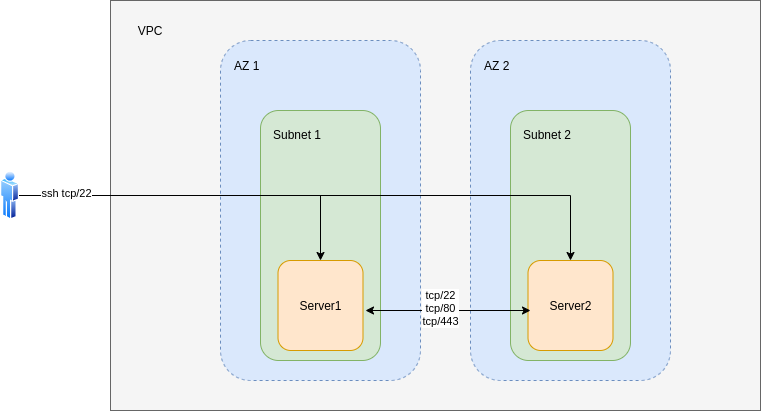

# Terraform Task

## Requirements:

- [x] Create a VPC with at least 2 Subnets in separate availabilty zones
- [x] 2 EC2 Instances, each in its own subnet. Names: Server1, Server2
- [x] Terraform should print the IPs of the instances and _any info needed to log into them_
- [x] User should be able to ssh into Server1 and Server2
- [x] Server1 and Server2 should be able to communicate over tcp/22 (assumption: With each other and with the external user)
- [x] Server1 and Server2 should be cble to comunication with eachother on tcp/80 and tcp/443
- [x] `terraform destroy` should remove all the resources created

## Bonus:

- [ ] have terraform deploy something that listens on tcp/80 and tcp/443
- [x] utilize data source feature of terraform
- [x] utilize modules
- [x] write a paragraph on what I like/dislike about terraform
- [ ] configure a service on one of the instances using chef

## Architecture:

## Terraform likes and dislikes

With the qualification that my experience with Terraform isn't very extensive, I actually find it great to work with and really like what it is capable of with such little code. I love the design behind modules and the reusability that it enables. I also think the HCL language was thoughtfully designed, striking a nice balance between familiar and accessible formats such as json and the expressiveness and capabilities of some functional languages. The documentation is well organized and complete. I also appreciate the tooling ecosystem around Terraform. For small projects like this it's seamless to get up and running with the Terraform cloud. Also in regard to the tooling I appreciate the golang-like autoformatting of `terraform fmt`. I am also really enjoying the [terraform-lsp](https://github.com/juliosueiras/terraform-lsp) which integrates no-problem with vim.  I am hard pressed to think of something I _don't_ like about it. That said, I can imagine challenges when developing larger-scale terraform projects where one might be dealing with complex environments. This is by no means unique to terraform however and I suspect my lack of deep experience with it contributes to this suspicion of mine.
